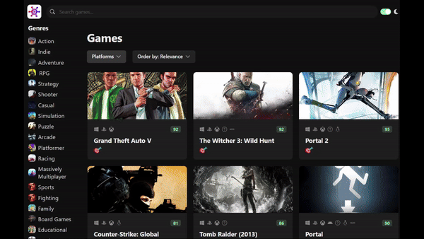

<div id="top"></div>

<br />
<div align="center">
  <a href="https://github.com/lorena-swe/game-hub">
    
  </a>
  
  <h3 align="center">Game Hub</h3>
  
  <br />

  <p align="center">
    <a href="https://lorena-swe-game-hub.vercel.app/" target="_blank">View Website</a>
    ·
    <a href="https://github.com/lorena-swe/game-hub">Code</a>
  </p>
</div>

<br /><br />

<!-- ABOUT THE PROJECT -->

## About The Project

<div align="center">
  <a href="https://lorena-swe-game-hub.vercel.app/">
    
  </a>
</div>

<br />

In this project, I worked with the RAWG.io API to develop a web app displaying a comprehensive list of video games, which can then be filtered by keywords, genres, and platforms, as well as sorted by multiple variables. The website also provides loading skeletons for a seamless and interactive user experience! I had plenty of fun developing this project, as video games are one of my fondest passions and inspired me to get into the programming world in the first place!

### Features

- **Comprehensive Game List**: Displays a wide range of video games using the RAWG.io API.
- **Filtering**: Filter games by keywords, genres, and platforms.
- **Sorting**: Sort games by various criteria.
- **Loading Skeletons**: Provides a smooth user experience while data is being fetched.

### Built With

- [React.js](https://reactjs.org/)
- [Chakra UI](https://v2.chakra-ui.com/)
- TypeScript
- HTML & CSS
- [RAWG.io API](https://rawg.io/apidocs)

<!-- GETTING STARTED -->

## Getting Started

To get a local copy up and running, follow these simple example steps:

### Prerequisites

Ensure you have npm installed:

```sh
npm install npm@latest -g
```

### Installation

1. Clone the repo

```sh
git clone https://github.com/lorena-swe/game-hub.git
```

2. Install NPM Packages

```sh
npm install
```

3. Run the app in development mode

```sh
npm start
```

4. Open [http://localhost:5173](http://localhost:5173) (port number might differ) to view it in your browser. The page will reload as you make changes to the code.

## Contributing

Contributions are what make the open source community such an amazing place to learn, inspire, and create. Any contributions you make are **greatly appreciated**.

1. Fork the Project
2. Create your Feature Branch (`git checkout -b feature/AmazingFeature`)
3. Commit your Changes (`git commit -m 'Add some AmazingFeature'`)
4. Push to the Branch (`git push origin feature/AmazingFeature`)
5. Open a Pull Request

## License

Distributed under the MIT License. See `LICENSE` for more information.

## Contact

Lorena - [LinkedIn](https://www.linkedin.com/in/lorena-zotaj/)

Project Link: [https://github.com/lorena-swe/game-hub](https://github.com/lorena-swe/game-hub)

<p align="right">(<a href="#top">back to top</a>)</p>
